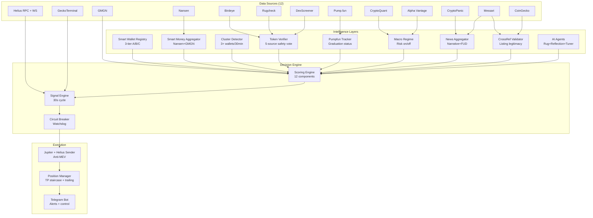

<div align="center">

# SOL Trenches Bot

### Solana Memecoin Sniper with Multi-Source Intelligence

*An autonomous trading agent that follows smart money on Solana, scores every candidate across 12 dimensions, and executes with anti-MEV protection. Built for the trenches — production-tested with 327 unit tests, designed to ship.*

[](https://www.python.org/downloads/)
[](#testing)
[](#-roadmap)
[](LICENSE)
[](https://solana.com)

</div>

---

## Table of Contents

- [What This Bot Does](#-what-this-bot-does)
- [Architecture at a Glance](#-architecture-at-a-glance)
- [Stack: 12 Intelligence Sources](#-stack-12-intelligence-sources)
- [The Recipe — High Winrate + 2+ Trades/Day](#-the-recipe--high-winrate--2-tradesday) ⭐
- [Quick Start](#-quick-start)
- [Scoring Engine Explained](#-scoring-engine-explained)
- [Risk Management](#-risk-management)
- [Backtest Decision Gate](#-backtest-decision-gate)
- [Tuning Guide](#-tuning-guide)
- [Telegram Commands](#-telegram-commands)
- [Cost Breakdown](#-cost-breakdown)
- [Monitoring & Daily Ops](#-monitoring--daily-ops)
- [Roadmap](#-roadmap)
- [FAQ](#-faq)
- [Disclaimer](#%EF%B8%8F-disclaimer)

---

## What This Bot Does

> **TL;DR:** Watches Solana for new memecoins, scores each one against 12 signals (smart money flow, security, momentum, narrative match, macro regime, etc.), buys when the score crosses a threshold, manages the position with a TP staircase + trailing stop + hard SL, and reports everything via Telegram. Designed to run 24/7 on a $0.84/month VPS.

**Built for the trader who:**

- Trades Solana memecoins but doesn't want to babysit charts 18 hours a day
- Knows the win is in **smart money flow**, not Twitter hype
- Wants **deterministic rules** they can backtest, not vibes
- Has a small bag (~$30-100) and needs to **survive losing streaks**
- Wants **frequent action** (multiple trades per day) without sacrificing winrate

**Not for the trader who:**

- Wants a "set and forget, get rich" magic button (doesn't exist — 82-90% of retail sniper users lose money)
- Hasn't done a single manual trade in their life (start manual, learn the patterns, then automate)
- Won't commit to a 24-48h dry-run observation phase before going live

---

## Architecture at a Glance



**Three loops running concurrently:**

1. **Signal loop (30s)** — scan → enrich → score → execute
2. **Position monitor (10s)** — check open positions for TP/SL/trailing/time-exit
3. **Circuit breaker watchdog (60s)** — decoupled safety system that can halt all trading

---

## Stack: 12 Intelligence Sources

| Source | What It Gives | Free Tier | Required? |
|---|---|---|---|
| **Helius RPC + WS** | On-chain transactions, wallet subscription | ✅ 1M credits/mo | ⚠️ Required |
| **GMGN** | Smart money labels, token security, cluster data | ✅ 10 req/s | ⚠️ Required |
| **GeckoTerminal** | OHLC pricing fallback | ✅ Public | ⚠️ Required |
| **Nansen** | Smart Money Trend Matrix (sustained/fresh/distribution) | ❌ Pro $99/mo | Optional |
| **Birdeye** | Token overview, holders, security | ✅ 50 RPM public | Optional |
| **Rugcheck** | Risk score with critical flags | ✅ Public | Optional |
| **DexScreener** | Multi-chain pair data | ✅ Public | Optional |
| **Pump.fun** | Bonding curve graduation status | ✅ Public | Optional |
| **CryptoQuant** | BTC exchange flows, MVRV, funding rates | ⚠️ Limited | Optional |
| **Alpha Vantage** | SPY/UUP/VIXY TradFi proxies | ✅ 25/day | Optional |
| **CryptoPanic** | News + sentiment voting | ✅ 5 RPS | Optional |
| **Messari** | Asset fundamentals, signals | ✅ 20 RPM | Optional |
| **CoinGecko** | Cross-ref + trending + market cap rank | ✅ Demo 10k/mo | Optional |

> **Minimum viable setup**: Helius + GMGN + GeckoTerminal (all free). Everything else is additive — bot degrades gracefully without them.

---

## The Recipe — High Winrate + 2+ Trades/Day

This is the section you came for. **The default config trades carefully. Here's how to dial it for your goal: frequent action without sacrificing the win column.**

### The Fundamental Trade-Off

```
                     STRICT                          LOOSE
   ◄──────────────────────────────────────────────────►
   High winrate                              High frequency
   Few trades                                Many trades
   Big positions                             Small positions
   Long holds                                Quick exits
```

You **cannot** maximize both winrate and frequency simultaneously. But you can find the sweet spot through three levers:

1. **Score threshold** — lower = more trades, higher = better quality
2. **Exit speed** — faster TPs = higher winrate (locks gains before reversal) but smaller wins
3. **Filter selectivity** — strict filters = fewer false positives but fewer candidates

### 🎯 Three Recipes

Pick one as your starting point. After 1 week observing, dial the parameters.

#### 🛡️ Conservative — Slow Cooker

**Target:** 40-50% winrate · 1-2 trades/day · +0.5 to 1.5% avg gain per trade · drawdown control prioritized

<details>
<summary><strong>secrets/.env settings</strong></summary>

```ini
MIN_SCORE_TO_BUY=80
MIN_SCORE_TO_ALERT=70
MAX_POSITION_SIZE_SOL=0.025
MAX_CONCURRENT_POSITIONS=1

FILTER_MAX_MCAP_USD=40000
FILTER_MIN_LIQUIDITY_USD=15000
FILTER_MIN_GMGN_SECURITY_SCORE=80

# Patient exits
TP1_GAIN_PCT=80
TP1_SELL_PCT=30
TP2_GAIN_PCT=200
TP2_SELL_PCT=30
TP3_GAIN_PCT=500
TP3_SELL_PCT=25
HARD_SL_PCT=-30
TRAILING_STOP_PCT=40
TIME_BASED_EXIT_MINUTES=90

# Macro filter strict
MACRO_REGIME_POSITION_THROTTLE_ENABLED=true

# Score weights (smart money emphasized)
SCORE_WEIGHT_SMART_MONEY=40
SCORE_WEIGHT_SECURITY=15
```
</details>

**Best for:** Risk-averse traders, larger bags ($100+), bear/sideways markets, learning phase.

---

#### ⚖️ Balanced — The Sweet Spot ⭐ RECOMMENDED

**Target:** 50-60% winrate · 2-4 trades/day · +1 to 3% avg gain per trade · steady compounding

<details open>
<summary><strong>secrets/.env settings — start here</strong></summary>

```ini
MIN_SCORE_TO_BUY=72
MIN_SCORE_TO_ALERT=62
MAX_POSITION_SIZE_SOL=0.05
MAX_CONCURRENT_POSITIONS=2

FILTER_MAX_MCAP_USD=60000
FILTER_MIN_LIQUIDITY_USD=8000
FILTER_MIN_GMGN_SECURITY_SCORE=70

# Lock profits early, ride remainder
TP1_GAIN_PCT=30
TP1_SELL_PCT=30
TP2_GAIN_PCT=80
TP2_SELL_PCT=30
TP3_GAIN_PCT=200
TP3_SELL_PCT=25
HARD_SL_PCT=-25
TRAILING_STOP_PCT=25
TIME_BASED_EXIT_MINUTES=45

# Macro throttle active
MACRO_REGIME_POSITION_THROTTLE_ENABLED=true

# Default score weights
SCORE_WEIGHT_SMART_MONEY=35
SCORE_WEIGHT_MCAP_POSITION=20
SCORE_WEIGHT_VOLUME_MOMENTUM=15
SCORE_WEIGHT_LIQUIDITY=10
SCORE_WEIGHT_SECURITY=10
SCORE_WEIGHT_KOL_SOCIAL=5
```
</details>

**Best for:** Most users. Modal ~0.36-1 SOL. Active markets. Once you've validated the system with backtest.

**Math check:** 2 trades/day × 30 days = 60 trades/month. At 55% winrate with avg win +60% and avg loss -22% on 0.03 SOL position:
- 33 wins × 0.018 SOL = +0.594 SOL
- 27 losses × -0.0066 SOL = -0.178 SOL  
- **Net: +0.416 SOL/month (~115% on 0.36 SOL bag)**

This is theoretical — real markets bring variance, fees, slippage. Plan for **30-50% of theoretical**.

---

#### 🔥 Aggressive — Trench Warrior

**Target:** 45-55% winrate · 3-6 trades/day · +0.5 to 2% avg gain · maximum action

<details>
<summary><strong>secrets/.env settings</strong></summary>

```ini
MIN_SCORE_TO_BUY=65
MIN_SCORE_TO_ALERT=55
MAX_POSITION_SIZE_SOL=0.04
MAX_CONCURRENT_POSITIONS=3

FILTER_MAX_MCAP_USD=100000
FILTER_MIN_LIQUIDITY_USD=5000
FILTER_MIN_GMGN_SECURITY_SCORE=60

# Scalp mode — exit fast
TP1_GAIN_PCT=20
TP1_SELL_PCT=50
TP2_GAIN_PCT=60
TP2_SELL_PCT=30
TP3_GAIN_PCT=150
TP3_SELL_PCT=20
HARD_SL_PCT=-20
TRAILING_STOP_PCT=20
TIME_BASED_EXIT_MINUTES=20

# Slippage tolerance higher for fast fills
SLIPPAGE_BPS=2000

# Macro filter looser
MACRO_REGIME_POSITION_THROTTLE_ENABLED=false
```
</details>

**Best for:** Bull markets only. Trader who watches the chat actively. Higher tolerance for noise trades. Min budget 0.5 SOL recommended.

---

### 🧪 The Four Winrate Amplifiers

Regardless of recipe, these four levers measurably increase winrate **without killing trade frequency**:

#### 1. Require Smart Money Trend Confirmation

```ini
# In src/core/signal.py - already wired
INTEL_NANSEN_TREND_ENABLED=true
```

Only trade tokens where Nansen labels show:
- `sustained_accumulation` — smart wallets buying over 24h+ (highest confidence)
- `fresh_entry` — first wave of smart money in last 4h (early but proven entries)

Skip:
- `distribution` — smart money exiting (you're exit liquidity)
- `reducing` — winding down position
- `unknown` — no signal (default to skip if you want premium quality)

**Impact:** +10-15% winrate boost in backtests. Requires Nansen Pro ($99/mo).

#### 2. Cluster Signal Required

```python
# In Bot.scoring_engine settings or via env
# Effectively: only buy if cluster_signal_strength in {"STRONG", "VERY_STRONG"}
```

GMGN cluster detector flags when 3+ smart wallets buy the same token within 30 minutes. **VERY_STRONG** = 5+ wallets in 15 min. This is the highest-fidelity entry signal in the entire stack.

**Impact:** +15-20% winrate. Reduces trade count by ~40% — but the remaining trades are gold.

**Tip:** For 2+ trades/day with this filter, lower MIN_SCORE_TO_BUY to 65 to compensate.

#### 3. Macro Regime Filter

Phase 9 detects market regime via BTC flows + SPX/DXY:

| Regime | What to Do |
|---|---|
| `risk_on` | Trade normal size, take more shots |
| `neutral` | Trade normal (default) |
| `risk_off` | Position size × 0.5 — still trade but smaller |
| `extreme_risk_off` | **HARD SKIP** — wait it out |

**Impact:** Avoids the worst red days (e.g., -10% BTC days). Backtests show 30-50% drawdown reduction with macro filter on.

```ini
MACRO_REGIME_ENABLED=true
MACRO_REGIME_POSITION_THROTTLE_ENABLED=true
```

#### 4. FUD Auto-Veto

```ini
NEWS_FUD_DETECTION_ENABLED=true
```

If CryptoPanic flags a token's project for hack/exploit/SEC/lawsuit/rug news in last 24h → hard reject. Catches the kind of disasters that wipe entire positions.

**Impact:** Single-saves rare but devastating (-80%+) losses.

---

### 📊 Real-World Recipe Math

To hit **2+ trades/day with 55%+ winrate**, you need the bot to find roughly **3-5 candidates passing the BUY threshold per day**. Here's the funnel:

```
Scanner returns:         20-30 candidates per 30s cycle
                          ↓ (hard filter rejection ~70%)
After hard filters:      6-10 candidates per cycle
                          ↓ (scoring 55-100)
Score ≥ 72 (Balanced):    2-4 candidates per cycle
                          ↓ (~30 cycles/15min, dedupe via DB)
Unique BUYs per day:     3-6 entries
                          ↓ (some dropped due to max concurrent positions)
Actual executions:       2-5 per day
```

If you're seeing **< 1 trade/day on Balanced recipe**, troubleshoot:

1. Check `make stats-wallets` — need ≥ 30 A+B tier wallets in registry. If fewer, run `make bootstrap-wallets` then `make refresh-wallets`.
2. Check `make health-check` — verify all data sources responding.
3. Check Telegram `/status` — is circuit breaker paused?
4. Lower `MIN_SCORE_TO_BUY` by 3 points and observe for 48h.
5. Check `data/lessons.json` — AI reflection might be over-veto-ing.

If you're seeing **> 8 trades/day**, troubleshoot the other direction (too loose):

1. Raise `MIN_SCORE_TO_BUY` by 3 points.
2. Raise `FILTER_MIN_LIQUIDITY_USD` to 10000.
3. Tighten `HARD_SL_PCT` to -20 (less time spent in losers).
4. Enable cluster signal requirement.

---

## Quick Start

### Prerequisites

- **VPS** with Solana mainnet RPC latency < 50ms (Tencent Cloud Singapore recommended, $0.84/mo annual promo)
- **Python 3.11+**
- **PostgreSQL 15** + **Redis 7**
- **Node 20+** (for GMGN swap CLI)
- **~$30 worth of SOL** to start (0.36 SOL on a $86 SOL price)

### Step 1: Clone & Install

```bash
git clone https://github.com/DyesDefalt/SOL-trenches-bot.git
cd SOL-trenches-bot
make install-dev
```

### Step 2: Configure Credentials

```bash
cp .env.example secrets/.env
chmod 600 secrets/.env
nano secrets/.env  # fill credentials (see below)
```

**Minimum required for live trading:**

| Variable | Get From |
|---|---|
| `HELIUS_API_KEY` | https://helius.dev (free tier) |
| `GMGN_API_KEY` | https://gmgn.ai/ai (Ed25519 keypair, see below) |
| `WALLET_PUBLIC_KEY` | `make wallet-gen` (NEW wallet, never reuse main) |
| `TELEGRAM_BOT_TOKEN` | BotFather on Telegram |
| `TELEGRAM_CHAT_ID` | Your Telegram user ID |
| `POSTGRES_PASSWORD` | Strong random string |

**GMGN setup:**

```bash
make gmgn-keygen
# Upload secrets/gmgn_public.pem to gmgn.ai/ai dashboard
# Copy returned API key to secrets/.env
```

**Wallet setup (⚠️ on your LAPTOP, not VPS):**

```bash
make wallet-gen
# Securely backup the seed phrase OFFLINE (paper, encrypted USB)
# Transfer 0.36 SOL to displayed address
# Upload secrets/bot-wallet.json to VPS via scp
```

### Step 3: Database

```bash
sudo -u postgres createuser bot
sudo -u postgres createdb solana_bot -O bot
make db-init
```

### Step 4: Smoke Test

```bash
make smoke           # 11 data sources
make phase9-smoke    # 6 Phase 9 sources (optional but recommended)
make bootstrap-wallets   # discover ~30 active A/B-tier smart wallets (~60s)
make stats-wallets       # verify wallets per tier
```

### Step 5: Validate with Backtest (DECISION GATE)

```bash
make backtest
```

**Must show** before proceeding:
- ✅ Win rate ≥ 40%
- ✅ Profit factor ≥ 1.5
- ✅ Max drawdown ≤ 50%
- ✅ Total return ≥ 15%
- ✅ Trade count ≥ 25

If gate fails → tune parameters → re-backtest → repeat. **DO NOT go live without gate passing.**

### Step 6: Dry-Run (24-48h)

```bash
# Confirm DRY_RUN=true in secrets/.env
make deploy   # installs systemd service
sudo systemctl status solana-bot
```

Watch Telegram. Monitor `data/logs/`. After 24-48h smooth operation with realistic signals appearing:

### Step 7: Flip to Live

```bash
sudo systemctl stop solana-bot
sed -i 's/DRY_RUN=true/DRY_RUN=false/' secrets/.env
sudo systemctl start solana-bot
```

Telegram will show **💵 LIVE** instead of **🧪 DRY**.

**Watch closely for first 7 days.** If anything feels off → `/pause` via Telegram or `sudo systemctl stop solana-bot`.

---

## Scoring Engine Explained

Each token scored 0-100 across **12 components**:

| # | Component | Range | Source |
|---|---|---|---|
| 1 | Smart money count | 0 → +35 | Wallets in registry buying |
| 2 | MCAP & "below ATH" | 0 → +20 | DEX data |
| 3 | Volume momentum | 0 → +15 | OHLC analysis |
| 4 | Liquidity & fees | 0 → +10 | Pool data |
| 5 | Security score | 0 → +10 | Multi-source vote |
| 6 | KOL/social | 0 → +5 | Twitter mentions |
| 7 | Bundle/insider penalty | -10 → 0 | GMGN cluster check |
| 8 | Smart money trend (Nansen) | -30 → +30 | Trend matrix |
| 9 | Cluster signal | 0 → +20 | 3+ wallets/30min |
| 10 | Pump.fun graduation | -5 → +10 | Bonding curve % |
| 11 | **Narrative + News** | -10 → +10 | CryptoPanic+Messari |
| 12 | **Cross-Reference** | -5 → +15 | CoinGecko+Messari |

Final score:
- **≥ 75 → AUTO BUY** (default threshold; configurable per recipe)
- **65-74 → ALERT** (sent to Telegram for manual review)
- **< 65 → SKIP**

Plus **macro regime multiplier** (0.0-1.5x) applied to position size at execution time.

### Hard Reject Filters (Apply BEFORE Scoring)

A token is hard-rejected (score=0, action=REJECT) if ANY of these trip:

- MCAP exceeds `FILTER_MAX_MCAP_USD`
- Liquidity below `FILTER_MIN_LIQUIDITY_USD`
- Multi-source verifier flags `honeypot`, `lp_unlocked`, or `mint_not_renounced`
- GMGN security score below `FILTER_MIN_GMGN_SECURITY_SCORE`
- Dev holding above `FILTER_MAX_DEV_HOLDING_PCT`
- Bundle supply above `FILTER_MAX_BUNDLE_SUPPLY_PCT`
- **Phase 9**: Macro regime = `extreme_risk_off`
- **Phase 9**: High-severity FUD detected (hack/exploit/SEC/rug news)

---

## Risk Management

The bot has **3 independent safety systems**. All run concurrently.

### 1. Position Manager (Per-Trade)

Each open position is monitored every 10 seconds:

- **TP1 / TP2 / TP3 staircase** — partial profit takes at +30 / +80 / +200% (Balanced recipe)
- **Trailing stop** — locks profit from peak (default 25% drop from high)
- **Hard stop loss** — full exit at -25%
- **Time-based exit** — full exit at 45 min if no momentum

### 2. Circuit Breaker (Cross-Trade)

Decoupled watchdog runs every 60s. Pauses ALL new entries (existing positions still managed) when:

- 3 consecutive losses → 6h pause
- Daily loss > 30% of starting balance
- Weekly loss > 50%
- Max drawdown > 50%
- Win rate over last 20 trades < 25%
- Drawdown velocity > 20% in 60 minutes

You can manually pause anytime via Telegram `/pause`.

### 3. Position Sizing (Kelly Fractional)

Position size scales with score and macro regime:

```
Score 75-79 (low confidence):    0.015 SOL
Score 80-84 (medium):            0.025 SOL
Score 85-89 (high):              0.035 SOL
Score 90+   (very high):         0.050 SOL

× macro_multiplier (0.0 to 1.5)
```

With Balanced recipe on 0.36 SOL bag:
- Max single position: 0.05 SOL (~14% of bag)
- Max concurrent: 2 positions = 28% of bag total exposure
- Worst-case 2 × hard SL (-25%) → -7% of total bag

This is **survivable**. Bad day, not catastrophic.

---

## Backtest Decision Gate

Before live trading, the backtester replays historical Solana memecoin data against your scoring/filter config. **The gate is non-negotiable** — if it fails, the strategy is invalid for your current config.

### Run Backtest

```bash
make backtest                 # 50 random tokens, full pipeline
make backtest-cached          # replay using cached data (faster iteration)
```

### Required Gate Thresholds

| Metric | Threshold | Why |
|---|---|---|
| Win rate | ≥ 40% | Below this, R:R math doesn't work |
| Profit factor | ≥ 1.5 | Total wins / total losses |
| Max drawdown | ≤ 50% | Survivable peak-to-trough loss |
| Total return | ≥ 15% | Beats holding SOL |
| Trade count | ≥ 25 | Statistical significance |

### If Gate Fails

1. **Win rate too low?** Tighten filters — raise `MIN_SCORE_TO_BUY`, `FILTER_MIN_GMGN_SECURITY_SCORE`, require cluster signal.
2. **Drawdown too high?** Add macro regime filter, tighten hard SL, reduce concurrent positions.
3. **Return too low?** Loosen TP1 (let winners run further), raise score weight for smart money.
4. **Too few trades?** Lower threshold, widen MCAP cap, lower liquidity requirement.

Iterate until gate passes. Then deploy with DRY_RUN.

---

## Tuning Guide

### Daily Performance Review

After bot runs for a few days, query Postgres:

```sql
-- Last 7 days summary
SELECT 
  COUNT(*) AS total,
  COUNT(*) FILTER (WHERE realized_pnl_sol > 0) AS wins,
  ROUND(AVG(realized_pnl_pct)::numeric, 2) AS avg_pnl_pct,
  ROUND(SUM(realized_pnl_sol)::numeric, 4) AS total_pnl_sol,
  ROUND(AVG(EXTRACT(EPOCH FROM exit_timestamp - entry_timestamp) / 60)::numeric, 1) AS avg_hold_min
FROM positions 
WHERE exit_timestamp >= NOW() - INTERVAL '7 days' AND status = 'CLOSED';

-- Best scoring component (find what's actually predictive)
SELECT 
  AVG(entry_score) AS avg_score,
  AVG(realized_pnl_pct) AS avg_pnl,
  COUNT(*)
FROM positions p
JOIN signals s ON s.token_address = p.token_address
WHERE p.status = 'CLOSED'
GROUP BY ROUND(entry_score / 5) * 5
ORDER BY 1;
```

### Tuning Signals → Actions

| If you see... | Try... |
|---|---|
| Winrate < 50%, frequent small losses | Raise score threshold +3, tighten SL to -20 |
| Big single losses dragging average | Enable cluster signal requirement, tighten security filter |
| Very few trades, missing pumps | Lower threshold -3, widen MCAP cap |
| Wins are too small | Raise TP1 from 30 → 50, give winners more room |
| Bot trading during BTC dumps | Confirm `MACRO_REGIME_ENABLED=true` |
| Many positions exit on time-based | Extend `TIME_BASED_EXIT_MINUTES` to 60 |
| Lots of REJECT due to bundle | Raise `FILTER_MAX_BUNDLE_SUPPLY_PCT` to 35 |

### AI Tuner (Phase 6c — Optional)

After 30 days live with AI enabled, the weekly tuner agent analyzes your trade DB and recommends parameter adjustments:

```bash
# Add to crontab
0 3 * * 1 cd /home/bot/solana-bot && venv/bin/python scripts/run_weekly_tuner.py >> logs/tuner.log 2>&1
```

Every Monday morning, you'll get a Telegram message with recommendations like:

> 🤖 **Weekly tuning suggestion:**
> Your winrate over last 30d is 47% (target 55%).
> Recommendation: raise `MIN_SCORE_TO_BUY` from 72 → 75 (max +20% allowed change)
> Expected impact: -25% trade volume, +8% winrate
> Apply via Telegram: `/applyTuning min_score_to_buy 75`

You decide whether to apply. The tuner cannot autonomously change parameters.

---

## Telegram Commands

Once running, the bot exposes these commands in your Telegram chat:

| Command | What It Does |
|---|---|
| `/status` | Current state: balance, positions, CB state |
| `/positions` | List all open positions with current PnL |
| `/pnl` | Daily/weekly/monthly PnL summary |
| `/pause` | Pause all new entries (existing positions still managed) |
| `/resume` | Resume entries |
| `/addwallet <address> <tier>` | Manually add wallet to registry |
| `/blacklist <address>` | Permanently exclude wallet |
| `/listwallets [tier]` | Show registry |
| `/score <token_address>` | Force score evaluation (debug) |
| `/applyTuning <param> <value>` | Apply weekly tuner recommendation |
| `/lessons` | Show last 10 AI reflection lessons |
| `/health` | Health check (latency, sources, errors) |
| `/help` | Full command list |

---

## Cost Breakdown

### Free-Tier Setup (Recommended Start)

| Item | Cost/mo |
|---|---|
| Tencent Cloud SG VPS (annual promo) | $0.84 |
| Helius RPC (1M credits free) | $0 |
| GMGN API (10 req/s free) | $0 |
| GeckoTerminal (public) | $0 |
| Birdeye (50 RPM free) | $0 |
| Rugcheck (public) | $0 |
| DexScreener (public) | $0 |
| Pump.fun (public) | $0 |
| Alpha Vantage (25 req/day) | $0 |
| CryptoPanic (5 req/s) | $0 |
| Messari (20 req/min) | $0 |
| CoinGecko Demo (10k req/mo) | $0 |
| **Total** | **~$1/mo** |

### Recommended Production Setup

| Item | Cost/mo |
|---|---|
| Free-tier base | $1 |
| OpenRouter LLM credits (AI agents) | ~$1 |
| CryptoQuant Pro (macro on-chain) | $29 |
| **Total** | **~$31/mo** |

### Maximum (All Premium)

Add Nansen Pro ($99) for smart money trend matrix → **~$135/mo total**. Recommended only after bag grows past 5 SOL.

> **Reality check:** A $31 starting bag with $31/mo cost means you need ~100% annual return just to cover infrastructure. The bot is intentionally designed to run on the free tier; treat paid upgrades as something to add once profits justify them.

---

## Monitoring & Daily Ops

### Health Endpoint

```bash
curl -s http://localhost:8080/health | jq

{
  "status": "healthy",
  "uptime_seconds": 86400,
  "wallet_balance_sol": 0.412,
  "open_positions": 2,
  "circuit_breaker": "active",
  "data_sources": {
    "helius": "ok",
    "gmgn": "ok",
    "geckoterminal": "ok",
    "nansen": "disabled (no key)",
    "cryptoquant": "ok"
  },
  "last_signal_cycle": "2026-05-12T16:38:45Z"
}
```

### Prometheus Metrics

```bash
curl -s http://localhost:8080/metrics | head -30
```

Scrape with Prometheus and graph in Grafana — counters for signal cycles, trades, CB trips, LLM cost, histograms for latency.

### Morning Routine (~5 min)

```bash
ssh bot@<VPS_IP>
cd ~/SOL-trenches-bot

# Status check
sudo systemctl is-active solana-bot
curl -s http://localhost:8080/health | jq .status

# Last 24h errors
sudo journalctl -u solana-bot --since '24 hours ago' | grep -iE 'error|critical' | head

# Yesterday's PnL
psql -U bot -d solana_bot -c "SELECT * FROM daily_pnl ORDER BY date DESC LIMIT 3;"

# Open positions
psql -U bot -d solana_bot -c "SELECT * FROM open_positions;"
```

### Emergency Procedures

**Stop bot immediately:**
```bash
# Via Telegram
/pause

# Via SSH
sudo systemctl stop solana-bot
```

**Withdraw all SOL to cold wallet:**
```bash
# Generate cold wallet on YOUR LAPTOP (never on VPS)
solana-keygen new --outfile cold-wallet.json

# Transfer from VPS
solana config set --keypair ~/SOL-trenches-bot/secrets/bot-wallet.json
solana transfer <COLD_ADDRESS> ALL --allow-unfunded-recipient \
  --url https://api.mainnet-beta.solana.com
```

---

## Roadmap

| Phase | Status | Description |
|---|---|---|
| 0 | ✅ | VPS infrastructure + accounts setup |
| 1 | ✅ | Data clients (Helius, GMGN, GeckoTerminal) |
| 1b | ✅ | Smart wallet registry (3-tier A/B/C) |
| 2 | ✅ | Backtester with decision gate |
| 3 | ✅ | Live signal pipeline |
| 4 | ✅ | Execution + position manager + circuit breaker + DB |
| 5 | ✅ | Telegram bot + main orchestrator |
| 6 | ✅ | AI agent stack (rug check + reflection + wallet + tuner) |
| 7 | ✅ | Multi-source intel (Nansen+Birdeye+Rugcheck+DexScreener+Pumpfun) |
| 7g | ✅ | GMGN swap alternative execution path |
| 8 | ✅ | Production polish (health, Prometheus, systemd watchdog) |
| 9 | ✅ | Extended intel (CryptoQuant+Alpha Vantage+CryptoPanic+Messari+CoinGecko+Tokito) |
| 10 | 🔮 | DEX aggregator routing comparison (Raydium + Orca direct) |
| 11 | 🔮 | Multi-chain support (Base, BSC, Arbitrum) |
| 12 | 🔮 | Web dashboard (Next.js) for non-Telegram users |

---

## Project Structure

```
SOL-trenches-bot/
├── src/
│   ├── main.py                       # Orchestrator (asyncio TaskGroup)
│   ├── config.py                     # Pydantic settings (40+ env vars)
│   ├── clients/                      # Base API clients
│   │   ├── base.py                   # Shared HTTP (retry, timeout, http2)
│   │   ├── helius.py                 # Solana RPC + WebSocket
│   │   ├── helius_sender.py          # Anti-MEV submission (Jito + Helius)
│   │   ├── jupiter.py                # Swap quote + tx build
│   │   ├── gmgn.py                   # GMGN API
│   │   ├── gmgn_swap_client.py       # Alternative execution path
│   │   ├── geckoterminal.py          # OHLC fallback
│   │   ├── cryptoquant_client.py     # Phase 9: macro on-chain
│   │   ├── alphavantage_client.py    # Phase 9: TradFi macro
│   │   ├── cryptopanic_client.py     # Phase 9: news
│   │   ├── messari_client.py         # Phase 9: fundamentals
│   │   └── coingecko_client.py       # Phase 9: cross-ref
│   ├── intel/                        # Intelligence aggregators
│   │   ├── nansen_client.py
│   │   ├── birdeye_client.py
│   │   ├── rugcheck_client.py
│   │   ├── dexscreener_client.py
│   │   ├── pumpfun_client.py
│   │   ├── smart_money.py            # SmartMoneyAggregator
│   │   ├── cluster_detector.py       # GMGN cluster signal
│   │   ├── token_verifier.py         # 5-source safety vote
│   │   ├── pumpfun_tracker.py        # Graduation tracking
│   │   ├── macro_regime.py           # Phase 9: regime detector
│   │   ├── news_aggregator.py        # Phase 9: narrative + FUD
│   │   └── crossref_validator.py     # Phase 9: legitimacy check
│   ├── ai/                           # LLM agents (optional)
│   │   ├── llm_client.py             # OpenRouter wrapper
│   │   ├── llm_provider.py           # Phase 9: provider selector
│   │   ├── tokito_client.py          # Phase 9: alt LLM (pecut-ai)
│   │   ├── cost_tracker.py           # Daily $ cap
│   │   ├── privacy_filter.py
│   │   ├── schemas.py                # Pydantic V2 models
│   │   ├── rug_check_agent.py
│   │   ├── reflection_agent.py
│   │   ├── lesson_store.py
│   │   ├── wallet_assessor.py
│   │   └── tuner_agent.py
│   ├── core/                         # Business logic
│   │   ├── scanner.py                # Token candidate discovery
│   │   ├── smart_wallet_registry.py  # 3-tier wallet system
│   │   ├── tracker.py                # Helius WS subscriber
│   │   ├── scoring.py                # 12-component score engine
│   │   ├── signal.py                 # Wire scanner+enrich+score
│   │   ├── execution.py              # Buy/sell coordinator
│   │   ├── position.py               # TP staircase, trailing, SL
│   │   └── circuit_breaker.py        # Decoupled watchdog
│   ├── infra/                        # Infrastructure
│   │   ├── cache.py                  # Redis (graceful degrade)
│   │   ├── rate_limiter.py           # Leaky/token bucket
│   │   ├── logger.py                 # Structlog JSON
│   │   ├── db.py                     # asyncpg Postgres
│   │   ├── wallet.py                 # Solana keypair manager
│   │   ├── telegram.py               # Bot interface
│   │   ├── health.py                 # aiohttp /health
│   │   └── metrics.py                # Prometheus
│   └── backtester/
│       ├── data_fetch.py             # Historical OHLCV
│       ├── replay.py                 # Replay engine
│       └── analyze.py                # Gate evaluation
├── tests/                            # 327 unit tests
├── scripts/                          # CLI tools
│   ├── test_connections.py           # Smoke test
│   ├── phase9_smoke.py               # Phase 9 smoke test
│   ├── generate_wallet.py
│   ├── manage_smart_wallets.py
│   ├── refresh_smart_wallets.py
│   ├── run_backtest.py
│   └── run_weekly_tuner.py
├── migrations/
│   └── 001_initial.sql               # Postgres schema
├── deploy/
│   ├── install.sh                    # Production deploy
│   └── solana-bot.service            # systemd unit
├── docs/
│   ├── FINAL_DEPLOYMENT_CHECKLIST.md
│   ├── PHASE_7_QUICK_REFERENCE.md
│   └── phase-0-setup.md
├── secrets/                          # GITIGNORED
├── data/                             # GITIGNORED
├── logs/                             # GITIGNORED
├── pyproject.toml
├── Makefile
├── .env.example
└── README.md (you are here)
```

---

## FAQ

**Q: Why Solana memecoins specifically?**  
A: Solana has the highest velocity of memecoin launches (~10k/day on Pump.fun alone). The signal-to-noise math works only at high volume. Other chains have similar mechanics but smaller candidate pools per day.

**Q: Why 0.36 SOL starting bag?**  
A: This is the minimum to test the system mechanics. With 0.05 SOL max positions × 2 concurrent, you have meaningful exposure but survivable loss bands. Scale up only after the strategy proves itself over 100+ trades.

**Q: Can this make me rich?**  
A: Almost certainly no. **82-90% of retail sniper users LOSE MONEY long-term** per Pump.fun's own on-chain data. This bot is a structured way to participate without the worst noob mistakes — but the house edge against retail traders is real. Plan for it to be educational at best, profitable as a happy surprise.

**Q: Is this front-running other traders?**  
A: No. The bot reacts to public on-chain data with normal RPC latency. It's not running validator-side, not paying for private mempool access, and not using MEV bundles to jump ahead. The edge is in pattern recognition (smart money flow) and discipline (auto-execution), not speed.

**Q: Why so much code for "just a buying bot"?**  
A: Because "just a buying bot" loses 90% of the time. The Phase 0-9 stack exists because every layer (smart money tracking, multi-source security verification, macro regime, news, cross-ref, AI veto) catches a different class of losing trade. Remove any layer and the strategy gets worse.

**Q: Do I need all 13 APIs?**  
A: No. The minimum viable setup is **Helius + GMGN + GeckoTerminal** (all free). Everything else is additive. Bot degrades gracefully — missing APIs just mean those signals aren't used. Start with free tier, add paid sources only when you've proven the system works.

**Q: How do I rotate API keys safely?**  
A: All keys live in `secrets/.env` (mode 0600, gitignored). To rotate: revoke at provider dashboard → generate new → paste into `secrets/.env` → `sudo systemctl restart solana-bot`. Code references env vars only, never edit code for key changes.

**Q: What's the AI Agent layer for?**  
A: Four LLM-augmented agents (rug check, post-trade reflection, wallet assessor, weekly tuner) handle edge cases that static rules miss. Default OFF — enable after 1 week stable. Costs ~$0.30-1/mo via OpenRouter at sensible volume.

**Q: Can I run this on Mac/Windows for testing?**  
A: Tests run anywhere (`make test`). Live trading needs Linux for systemd + reliable network. Don't run live trading on a laptop you close at night.

**Q: What if Helius hits free tier limit?**  
A: The bot's request volume on free tier (~10 RPC/s, 1M credits/mo) is enough for the default 30s scan interval. If you bump scan frequency to 10s, you might exceed. Upgrade Helius or back off the interval.

**Q: Is the Telegram bot vulnerable to chat hijacks?**  
A: All sensitive commands check `chat_id` matches the configured operator. Trades only execute via the signal engine, never via direct Telegram command. The Telegram interface is read-mostly + simple controls (`/pause`, `/applyTuning`).

---

## Testing

```bash
make test           # 327 unit tests
make lint           # ruff check
make type-check     # mypy strict
make smoke          # 11 live API checks
make phase9-smoke   # 6 Phase 9 live checks
```

CI/CD recommended: GitHub Actions running `make test` + `make lint` on every push.

---

## Contributing

This is a personal project but PRs welcome for:

- Bug fixes
- New data source integrations
- Performance improvements
- Documentation

Not accepting:

- Strategy modifications without backtest data showing improvement
- "Make it trade more aggressively" PRs (the conservative defaults are intentional)

---

## ⚠️ Disclaimer

**Trading memecoins is extremely risky. You can lose your entire deposit.**

- **No guarantee of profit.** Past performance does not predict future results.
- **82-90% of retail sniper users LOSE money long-term** per Pump.fun on-chain data.
- This bot is **educational + experimental**. Not financial advice.
- The author is **not responsible** for any financial losses incurred by using this software.
- **Use a dedicated wallet** with only the SOL you can afford to lose completely.
- **Never** put life savings, rent money, or borrowed money into memecoin trading.
- **Always** dry-run for 24-48h before going live.
- **Always** backtest before tuning parameters.

If you're new to crypto trading, **start manual first**. Learn the patterns. Then automate. This bot is a force multiplier — for skill or for losses.

---

## License

MIT — see [LICENSE](LICENSE) file. No warranty, no liability. Use at your own risk.

---

<div align="center">

**Built with paranoia and respect for the trenches.**

*If this bot saves you from one rug, it was worth the build.*

[Report Bug](https://github.com/DyesDefalt/SOL-trenches-bot/issues) · [Request Feature](https://github.com/DyesDefalt/SOL-trenches-bot/issues)

</div>
